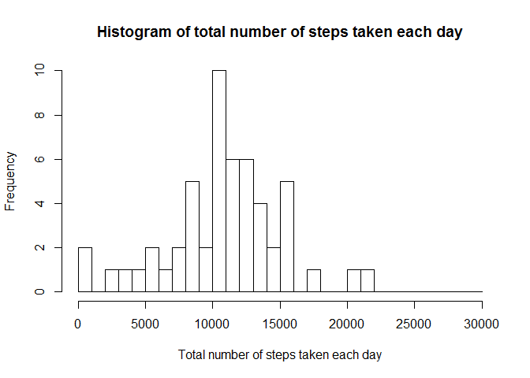
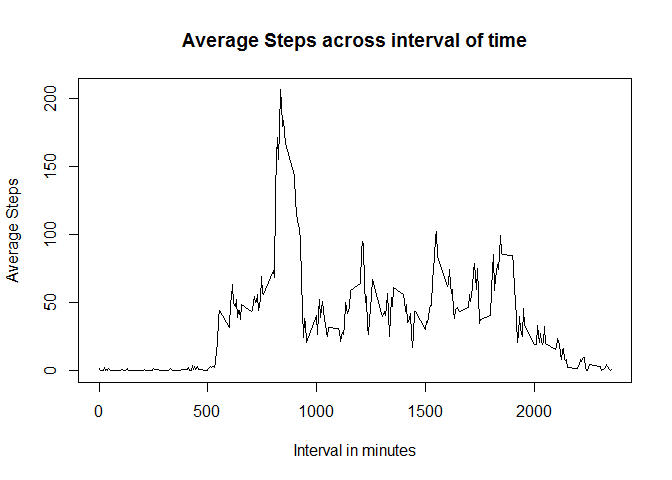
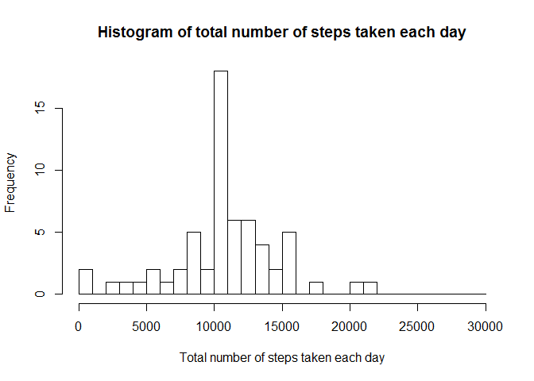
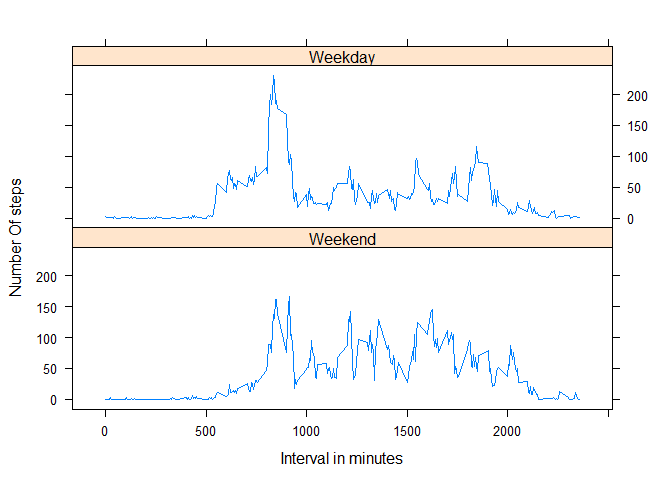

# Reproducible Research: Peer Assessment 1
RamKGubhaju  
March 19, 2016  


## Loading and preprocessing the data


```r
if(!file.exists("activity.csv"))
{
  unzip(zipfile = "activity.zip")
}
activity<-read.csv("activity.csv")
```

####Added the column of type of day whether it is weekday or weekend

```r
activity$positDate<-strptime(activity$date,format="%Y-%m-%d")
activity$dayType<-factor(weekdays(activity$positDate) %in% c("Saturday","Sunday"),labels = c("Weekend","Weekday"),levels=c(TRUE,FALSE)) 
```


## What is mean total number of steps taken per day?
The histogram of total number of steps taken each day

```r
aggActivity<-aggregate(steps~date,data=activity,FUN=sum)
aggActivity$date<-strptime(aggActivity$date,format="%Y-%m-%d")
hist(as.integer(aggActivity$steps),breaks=seq(from=0, to=30000, by=1000),xlab = "Total number of steps taken each day",
 main = "Histogram of total number of steps taken each day")
```




The Mean value is

```r
mean(aggActivity$steps,na.rm=TRUE)
```

```
## [1] 10766.19
```

The Median value is

```r
median(aggActivity$steps,na.rm=TRUE)
```

```
## [1] 10765
```

## What is the average daily activity pattern?
Aggregate the mean of steps based on interval

```r
aggActivityInterval<-aggregate(steps~interval,data=activity,FUN=mean)

plot(x = aggActivityInterval$interval,y=aggActivityInterval$steps,type = "l",xlab = "Interval in minutes",ylab = "Average Steps",
 main = "Average Steps across interval of time")
```



The maximum average steps on interval is following:

```r
aggActivityInterval[which.max(aggActivityInterval$steps),"interval"]
```

```
## [1] 835
```
## Imputing missing values

To fill up the NA on steps column, the average of steps of interval is used for specific interval where steps is NA. The average is rounded up to zero decimal point (as steps cannot be on fraction) while filling up the NA

```r
fillNA<-merge(activity,aggActivityInterval,by.x="interval",by.y="interval",all = TRUE)
for(i in 1:nrow(fillNA)){
      if(is.na(fillNA[i,"steps.x"]))
      {
        fillNA[i,"steps.x"]<-round(fillNA[i,"steps.y"],0)
      }
      
    }
colnames(fillNA)[which(names(fillNA) == "steps.x")] <- "steps"
```

Now calculate the total number of steps taken each day

```r
aggFillNA<-aggregate(steps~date,data=fillNA,FUN=sum)
aggFillNA$date<-strptime(aggFillNA$date,format="%Y-%m-%d")
hist(as.integer(aggFillNA$steps),breaks=seq(from=0, to=30000, by=1000),xlab = "Total number of steps taken each day",
 main = "Histogram of total number of steps taken each day")
```




The Mean value is

```r
mean(aggFillNA$steps,na.rm=TRUE)
```

```
## [1] 10765.64
```

The Median value is

```r
median(aggFillNA$steps,na.rm=TRUE)
```

```
## [1] 10762
```

The mean and median has been decreased after assigning the NA to average value. This may be probably due to the rounding to integer which increase the observation of mean and median but decreased overall observed value.

## Are there differences in activity patterns between weekdays and weekends?
Aggregate mean the steps based on interval and the type of the day and Make a panel plot based on type of day containing a time series plot

```r
library(lattice)
aggWeekend<-aggregate(steps~interval+dayType,data=fillNA,FUN=mean)
xyplot(steps~interval|dayType,data=aggWeekend,layout=c(1,2),type="l",xlab = "Interval in minutes",ylab = "Number Of steps")
```



The above plot suggests that there is indeed difference in activity patterns between weekdays and weekends
